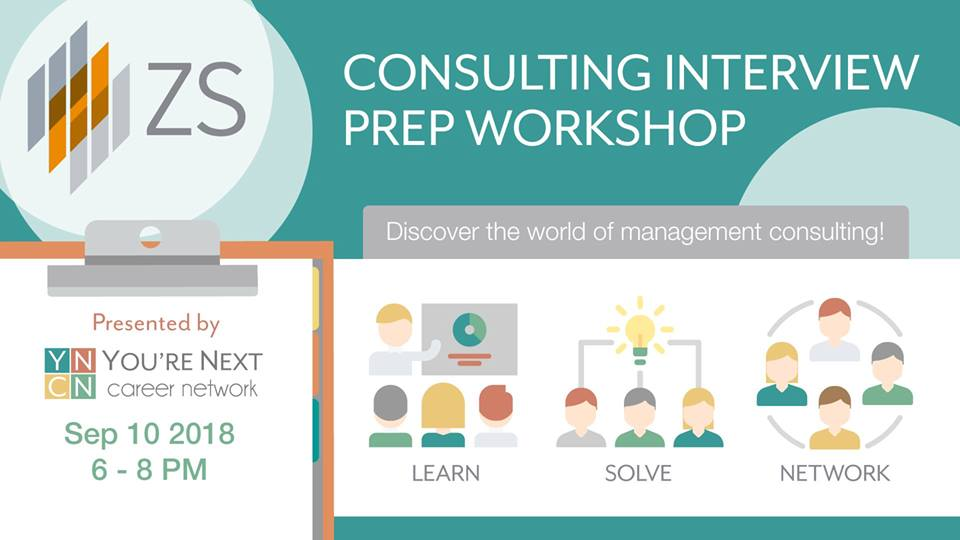

```{r setup, echo=FALSE, include=FALSE}
knitr::opts_chunk$set(echo = FALSE)
source('1 - Load + Clean Data.R')
source('2 - Graphs.R')
```

## 1.0 Event Overview

### 1.1 Event Description

Curious about the world of consulting? Looking to learn how to solve a consulting case? Want to pick the brain of a real consultant? 

Then come out to ZS Associates' Case Interview Prep Workshop to see what it takes to work in consulting! This workshop is the perfect opportunity for anyone of a math/engineering/analytics background to learn about ZS Associates and what they do, work through and solve a real-world case, and network with ZS reps!

ZS Associates is a consulting company that specializes in management consulting across industries such as energy, high-tech, and pharmaceuticals.

When: September 10, 2018 (6pm-8pm)
Where: BA2165

### 1.2 Target Audience

This event was primarily targeted at 3rd year engineering, cs and rotman students interested in doing their PEY at ZS Associates in a technical or consulting role.

## 2.0 Marketing Strategy and Branding Overview

### 2.1 Marketing Strategy
 
 We used the following marketing channels for this event:
 
\begin{itemize}
  \item Stuff
  \item More Stuff
\end{itemize}

### 2.2 Graphics Branding
For this event we made something beautiful that tried to be informative but also fun.




## 3.0 Results

### 3.1 Facebook Snapshot


### 3.2 Attendee Demographics
(remember to add in all our graphs + some analysis). Echo asks if we want to show what we are doing in R or no (supress output). Knit to export to PDF.
```{r echo=FALSE}
disc_breakdown
attendee_plot
attendee_status_plot
year_breakdown
```
